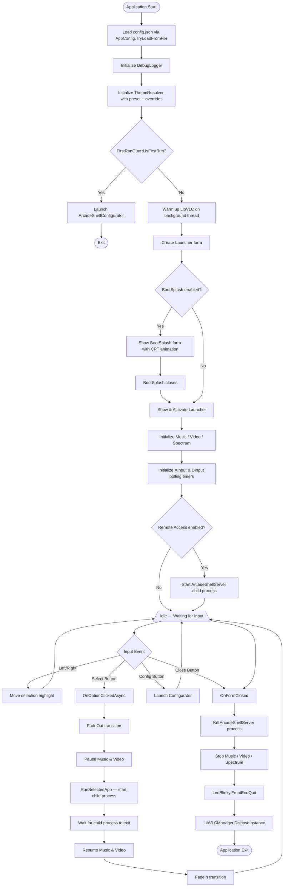
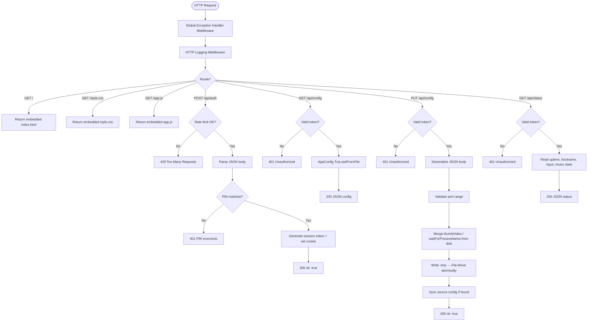
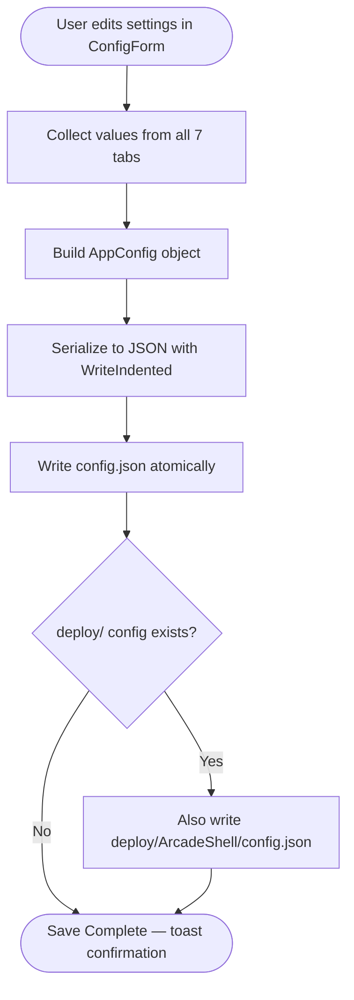
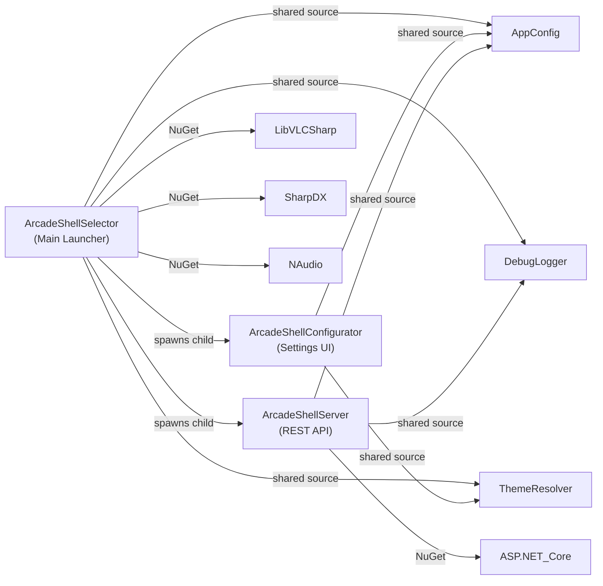

# ArcadeShellSelector — Architecture

## Overview

ArcadeShellSelector is a full-screen arcade cabinet launcher for Windows. It consists of three projects:

| Project | Type | Purpose |
|---|---|---|
| **ArcadeShellSelector** | WinForms (.NET 10) | Main launcher UI with gamepad input, media playback, and theming |
| **ArcadeShellConfigurator** | WinForms (.NET 10) | Settings editor with 7 tabs (options, input, music, video, theme, remote, debug) |
| **ArcadeShellServer** | ASP.NET Core (.NET 10) | HTTP REST API + mobile web UI for remote configuration |

---

## Class Diagram

```mermaid
classDiagram
    direction TB

    %% ════════════════════════════════════════════════════════════════
    %% Main Application
    %% ════════════════════════════════════════════════════════════════

    class Program {
        <<static>>
        +Main() void
        -RunApp() void
    }

    class Launcher {
        <<Form>>
        -config : AppConfig
        -musicPlayer : MusicPlayer
        -videoBackground : VideoBackground
        -spectrumAnalyzer : SpectrumAnalyzer
        -spectrumPanel : SpectrumPanel
        -_ledBlinky : LedBlinky
        -_serverProcess : Process
        +Launcher(preloadedConfig? : AppConfig)
        -InitializeForm() void
        -InitializeControls() void
        -InitDirectInput() void
        -XinputTimer_Tick() void
        -DinputTimer_Tick() void
        -MoveSelection(direction : int) void
        -SelectCurrentOption() void
        -OnOptionClickedAsync(pb, exe, wait) Task
        -FadeOutAsync(ms : int) Task
        -FadeInAsync(ms : int) Task
        -RunSelectedApp(exe, wait) string?
        -LayoutControls() void
    }

    class BootSplash {
        <<Form>>
        +BuildSequence(cfg : AppConfig) void
    }

    class FirstRunGuard {
        <<static>>
        +IsFirstRun(path, cfg) bool
        +Evaluate(path, cfg) bool
    }

    %% ════════════════════════════════════════════════════════════════
    %% Configuration
    %% ════════════════════════════════════════════════════════════════

    class AppConfig {
        <<sealed>>
        +Ui : UiConfig
        +Paths : PathConfig
        +Options : List~OptionConfig~
        +Music : MusicConfig
        +Autor : AutorConfig
        +Activa : DebugConfig
        +Input : InputConfig
        +LedBlinky : LedBlinkyConfig
        +Arranque : StartupConfig
        +Theme : ThemeConfig
        +RemoteAccess : RemoteAccessConfig
        +TryLoadFromFile(path)$ (AppConfig?, string?)
    }

    class UiConfig {
        <<sealed>>
        +Title : string
        +TopMost : bool
        +MinImageSizePx : int
        +ImageHeightRatio : double
        +FadeTransition : bool
        +FadeTransitionMs : int
        +SpectrumBands : int
    }

    class PathConfig {
        <<sealed>>
        +ToolsRoot : string
        +ImagesRoot : string
        +VideoBackground : string
        +VideoPlaybackRate : float
        +NetworkWaitSeconds : int
    }

    class OptionConfig {
        <<sealed>>
        +Label : string
        +Exe : string
        +Image : string
        +ThumbVideo : string?
        +WaitForProcessName : string?
    }

    class MusicConfig {
        <<sealed>>
        +Enabled : bool
        +MusicRoot : string?
        +PlayRandom : bool
        +Volume : int
        +AudioDevice : string?
        +ThumbVideoVolume : int
    }

    class InputConfig {
        <<sealed>>
        +XInputEnabled : bool
        +DInputEnabled : bool
        +DInputButtonSelect : int
        +DInputButtonBack : int
        +DInputDeviceName : string
        +NavCooldownMs : int
        +XInputSlot : int
        +XInputButtonSelect : int
        +XInputButtonBack : int
    }

    class ThemeConfig {
        <<sealed>>
        +Preset : string
        +LauncherFont : string?
        +BootSplashFont : string?
        +SelectionBorderColor : string?
        +BootSplashPreset : string?
        +BootSplashCrtEffects : bool
    }

    class RemoteAccessConfig {
        <<sealed>>
        +Enabled : bool
        +Port : int
        +Pin : string
        +Verbose : bool
    }

    class StartupConfig {
        <<sealed>>
        +BootSplashEnabled : bool
    }

    class LedBlinkyConfig {
        <<sealed>>
        +Enabled : bool
        +ExePath : string
    }

    class DebugConfig {
        <<sealed>>
        +Activa : bool
    }

    class AutorConfig {
        <<sealed>>
        +Quien : string
    }

    %% ════════════════════════════════════════════════════════════════
    %% Media & Audio
    %% ════════════════════════════════════════════════════════════════

    class MusicPlayer {
        <<IDisposable>>
        +IsPlaying : bool
        +HasTracks : bool
        +CurrentTrackPath : string?
        +LastError : string?
        +MusicPlayer(baseDir, musicCfg)
        +Start() void
        +Stop() void
        +Resume() void
        +SetVolume(vol : int) void
        +Dispose() void
    }

    class VideoBackground {
        <<IDisposable>>
        +View : VideoView
        +Available : bool
        +IsPlaying : bool
        +PlayLoop(path : string) void
        +Stop() void
        +Pause() void
        +Resume() void
        +SetPlaybackRate(rate : float) void
        +Dispose() void
    }

    class SpectrumAnalyzer {
        <<IDisposable>>
        +BandCount : int
        +SpectrumAnalyzer(bandCount : int)
        +GetBands(dest : float[]) void
        +Start() void
        +Stop() void
        +Dispose() void
    }

    class SpectrumPanel {
        <<Panel>>
        +SpectrumPanel(analyzer : SpectrumAnalyzer)
        +StartRefresh() void
        +StopRefresh() void
    }

    class TrackerMetadata {
        <<sealed>>
        +Title : string
        +Format : string
        +Tracker : string?
        +Channels : int
        +Patterns : int
        +Instruments : int
        +Bpm : int
        +SampleNames : List~string~
        +TryRead(filePath)$ TrackerMetadata?
    }

    %% ════════════════════════════════════════════════════════════════
    %% Infrastructure
    %% ════════════════════════════════════════════════════════════════

    class LibVLCManager {
        <<static>>
        +Instance$ : LibVLC
        +DisposeInstance()$ void
    }

    class ThemeResolver {
        <<static>>
        +Launcher$ : LauncherPalette
        +Boot$ : BootSplashPalette
        +PresetNames$ : IReadOnlyList~string~
        +BootPresetNames$ : IReadOnlyList~string~
        +Init(config : AppConfig)$ void
        +GetPresetPalettes(name)$ (LauncherPalette, BootSplashPalette)
        +GetAvailableFonts()$ string[]
    }

    class LauncherPalette {
        <<sealed>>
        +SelectionBorder : Color
        +HoverOutline : Color
        +Title : Color
        +ButtonText : Color
        +SpectrumBar : Color
        +Font : string
    }

    class BootSplashPalette {
        <<sealed>>
        +Bg : Color
        +Primary : Color
        +Dim : Color
        +Bright : Color
        +PhosphorTint : Color
        +ScanlineAlpha : int
        +CrtEffects : bool
        +Font : string
    }

    class DebugLogger {
        <<static>>
        +Init(enabled : bool)$ void
        +Info(component, message)$ void
        +Warn(component, message)$ void
        +Error(component, message)$ void
    }

    class LedBlinky {
        <<sealed>>
        +LedBlinky(config : LedBlinkyConfig)
        +FrontEndStart() void
        +StartAnimation() void
        +GameStart(romName?) void
        +FrontEndQuit() void
    }

    %% ════════════════════════════════════════════════════════════════
    %% Configurator
    %% ════════════════════════════════════════════════════════════════

    class ConfigForm {
        <<Form>>
        +ConfigForm()
    }

    class InputVisualPanel {
        <<Panel>>
        +XInputMode : bool
        +UpdateDInput(stickX, stickY, pov, buttons) void
        +UpdateXInput(stickX, stickY, rX, rY, ...) void
        +Reset() void
    }

    %% ════════════════════════════════════════════════════════════════
    %% Relationships
    %% ════════════════════════════════════════════════════════════════

    %% Composition — AppConfig owns its sub-configs
    AppConfig *-- UiConfig
    AppConfig *-- PathConfig
    AppConfig *-- OptionConfig
    AppConfig *-- MusicConfig
    AppConfig *-- InputConfig
    AppConfig *-- ThemeConfig
    AppConfig *-- RemoteAccessConfig
    AppConfig *-- StartupConfig
    AppConfig *-- LedBlinkyConfig
    AppConfig *-- DebugConfig
    AppConfig *-- AutorConfig

    %% ThemeResolver inner types
    ThemeResolver *-- LauncherPalette
    ThemeResolver *-- BootSplashPalette

    %% Startup dependencies
    Program --> AppConfig : loads
    Program --> DebugLogger : initializes
    Program --> ThemeResolver : initializes
    Program --> FirstRunGuard : checks
    Program --> LibVLCManager : warms up
    Program --> BootSplash : shows (optional)
    Program --> Launcher : creates & runs

    %% Launcher owns media components
    Launcher --> AppConfig : reads
    Launcher --> MusicPlayer : creates
    Launcher --> VideoBackground : creates
    Launcher --> SpectrumAnalyzer : creates
    Launcher --> SpectrumPanel : creates
    Launcher --> LedBlinky : creates
    Launcher --> DebugLogger : logs
    Launcher --> ThemeResolver : reads colors

    %% Media dependencies
    MusicPlayer --> LibVLCManager : uses Instance
    VideoBackground --> LibVLCManager : uses Instance
    SpectrumPanel --> SpectrumAnalyzer : reads bands

    %% BootSplash theming
    BootSplash --> ThemeResolver : reads Boot palette
    BootSplash --> AppConfig : reads sequence data

    %% Configurator
    ConfigForm --> AppConfig : loads & saves
    ConfigForm --> InputVisualPanel : embeds
    ConfigForm --> ThemeResolver : reads presets

    %% LedBlinky
    LedBlinky --> LedBlinkyConfig : reads
```

---

## Activity Diagram — Application Lifecycle

---

## Activity Diagram — ArcadeShellServer Request Flow

---

## Activity Diagram — Configurator Save Flow

---

## Project Dependencies

