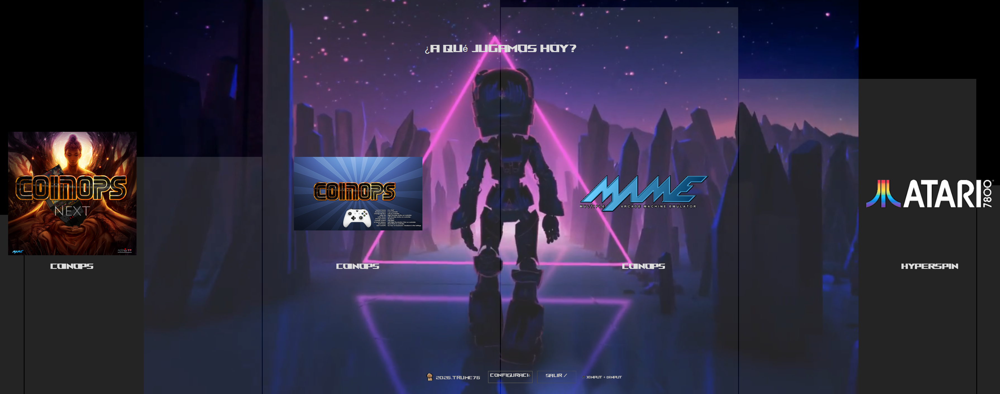
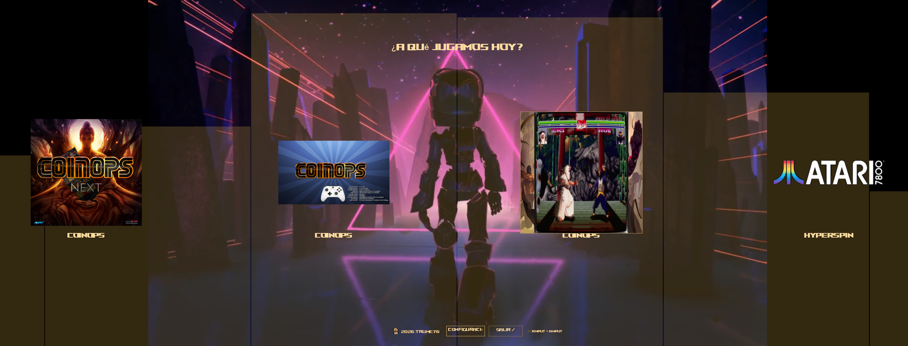
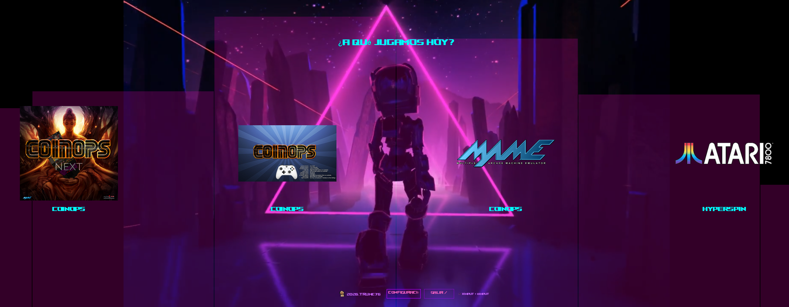
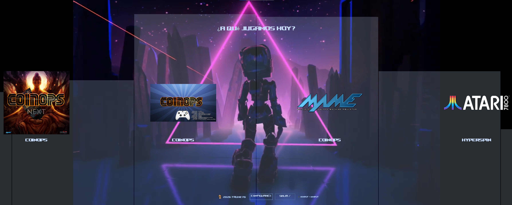
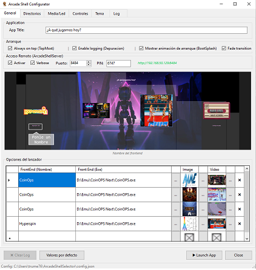
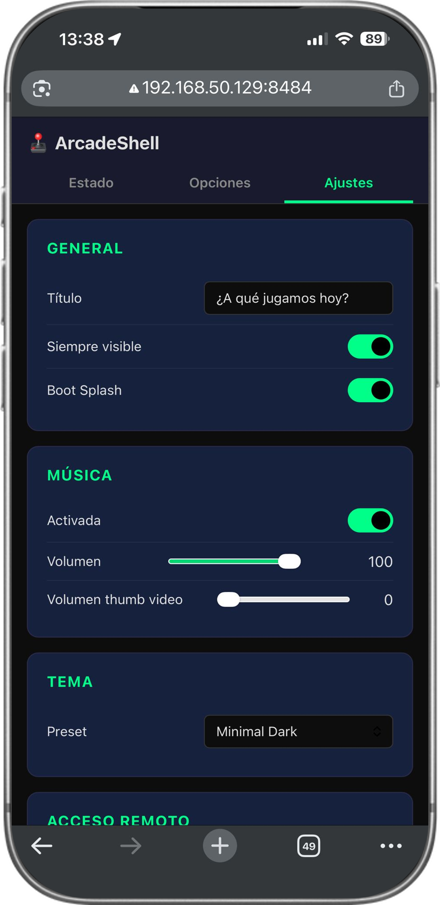

# ArcadeShellSelector

A full-screen arcade launcher for Windows that replaces the desktop shell. Pick your frontend, fire it up, and get back to playing — all from a controller-friendly, cinematic interface with video backgrounds, music, and CRT-style boot animations.

Comes with two companion tools:
- **ArcadeShellConfigurator** — 
- **ArcadeShellServer** — 

---

## Screenshots

### Launcher — Minimal Dark theme



### Launcher — Amber CRT theme



### Launcher — Synthwave theme



### Launcher — Ice Blue theme



### Configurator — Settings Editor



### Mobile Remote — Phone Dashboard



---

## Why this could be for you?

🕹️ **Multiple frontends, one launcher** — CoinOPS, HyperSpin, RetroArch, BigBox, MAME… stop choosing one and launch them all from a single full-screen menu.

📱 **Manage without a keyboard** — Change settings, switch themes, and edit options from your phone. No need to plug in a mouse or open a terminal.

🎨 **Looks like an arcade, not a desktop** — Video backgrounds, CRT boot animations, tracker music with spectrum visualizer — your cabinet feels like a real machine, not a PC.

🎮 **Any controller works** — Xbox pads, arcade encoders, Xin-Mo boards, keyboards — bind any button in seconds with the visual configurator.

🔒 **Boot straight into the launcher** — Replace the Windows shell entirely. No desktop, no Start menu, no distractions. Just games.

⚡ **Zero config on first run** — A setup guard walks you through configuration. No manual JSON editing required.

🌐 **PIN-protected remote access** — The built-in server is secured by a PIN and only accessible on your local network.

---

## What It Does

**ArcadeShellSelector** turns a Windows PC into a dedicated arcade cabinet. Instead of booting to the Windows desktop, your machine shows a full-screen launcher where every installed frontend (CoinOPS, HyperSpin, RetroArch, etc.) is a single button press away.

### For the player

- **Pick and play** — Navigate with a joystick, gamepad, or keyboard. Select a frontend and it launches instantly.
- **Video previews** — Hover over an option to see a thumbnail video preview of that frontend.
- **Music while you browse** — Tracker music (MOD/XM) plays in the background with a live spectrum analyzer.
- **Cinematic boot** — A retro CRT terminal animation greets you on startup (optional — you can skip it).

### For the operator

- **Manage from your phone** — Open your arcade's IP on any device in the local network, enter a PIN, and you can change the title, toggle music, switch themes, and edit launcher options without touching a keyboard.
- **Five built-in themes** — Neon Green, Amber CRT, Synthwave, Ice Blue, and Minimal Dark. Every color is customizable.
- **Full visual configurator** — A desktop app with tabs for general settings, paths, media, gamepad bindings (with live input testing), and logs.
- **Controller support** — XInput (Xbox), DirectInput (arcade encoders, Xin-Mo), and keyboard — all configurable with interactive button binding.
- **Video background** — A looping video fills the screen behind your options.
- **LedBlinky integration** — Optional LED feedback for arcade cabinets with LedBlinky hardware.
- **Shell replacement ready** — Designed to run as the Windows shell. Starts `explorer.exe` gracefully when you exit.

---

## Quick Start

### Requirements

- Windows 10/11
- .NET 10 SDK (for development) or .NET 10 Runtime (for deployment)
- PowerShell 7+ (for the packaging script)

### Build

```powershell
dotnet restore ArcadeShellSelector.sln
dotnet build ArcadeShellSelector.sln -c Release
```

### Run

Launch from the build output:

```
bin\Release\net10.0-windows\ArcadeShellSelector.exe
```

On first run, a setup guard detects that nothing is configured and prompts you to open the Configurator.

### Package for deployment

```powershell
# Framework-dependent (smaller, needs .NET runtime on target)
pwsh .\publish.ps1

# Self-contained (larger, runs anywhere)
pwsh .\publish.ps1 -SelfContained
```

Output goes to `deploy\ArcadeShell\` with a ready-to-deploy zip.

---

## Shell Replacement

To make this the Windows shell (instead of Explorer), set the registry:

```powershell
# Backup first
reg export "HKLM\SOFTWARE\Microsoft\Windows NT\CurrentVersion\Winlogon" "C:\ArcadeShell\winlogon-backup.reg" /y

# Set shell (elevated PowerShell)
Set-ItemProperty -Path "HKLM:\SOFTWARE\Microsoft\Windows NT\CurrentVersion\Winlogon" -Name Shell -Value "C:\ArcadeShell\ArcadeShellSelector.exe"

# Rollback to Explorer
Set-ItemProperty -Path "HKLM:\SOFTWARE\Microsoft\Windows NT\CurrentVersion\Winlogon" -Name Shell -Value "explorer.exe"
```

---

## Configuration

All settings live in `config.json`. Use the **Configurator** for a visual editor, or the **mobile server** from your phone.

Key sections:

| Section | What it controls |
|---|---|
| `ui` | Title, layout ratios, fade transitions, spectrum bands |
| `paths` | Tools root, images, video background, network wait |
| `options` | List of frontends (label, executable, image, video preview) |
| `music` | Tracker playback, volume, audio device |
| `theme` | Preset selection + custom colors for launcher and boot splash |
| `arranque` | Boot splash toggle |
| `input` | XInput/DInput enable, button mappings, nav cooldown |
| `ledblinky` | LedBlinky enable + executable path |
| `remoteAccess` | Mobile server enable, port, PIN |

---

## Technology

| Component | Library |
|---|---|
| UI Framework | WinForms (.NET 10) |
| Video playback | LibVLCSharp + VideoLAN.LibVLC.Windows |
| Audio / Spectrum | NAudio (WASAPI loopback) |
| Gamepad input | SharpDX.XInput + SharpDX.DirectInput |
| Mobile server | ASP.NET Core Kestrel (embedded) |

---

## Project Structure

```
ArcadeShellSelector.sln
├── ArcadeShellSelector/          Main launcher
│   ├── Program.cs                Entry point + lib probing
│   ├── FirstRunGuard.cs          Detects unconfigured state
│   ├── BootSplash.cs             CRT terminal boot animation
│   ├── Launcher.cs               Full-screen app selector
│   ├── AppConfig.cs              Config model + validation
│   ├── VideoBackground.cs        Background video (LibVLC)
│   ├── MusicPlayer.cs            Tracker music playback
│   ├── SpectrumAnalyzer.cs       WASAPI audio visualization
│   ├── LedBlinky.cs              LED hardware integration
│   └── DebugLogger.cs            Structured logging + rotation
├── ArcadeShellConfigurator/      Visual settings editor
│   ├── ConfigForm.cs             Tabbed config UI
│   └── InputVisualPanel.cs       Live gamepad input display
├── ArcadeShellServer/            Mobile remote server
│   ├── Program.cs                Kestrel REST API
│   └── wwwroot/                  Embedded web UI (HTML/CSS/JS)
├── Media/
│   ├── Screenshots/              README images
│   ├── Bkg/                      Background videos
│   ├── Img/                      Option images
│   ├── Music/                    Tracker files (MOD/XM)
│   ├── Sounds/                   Boot animation audio
│   └── Video/                    Thumbnail preview videos
├── config.json                   Runtime configuration
└── publish.ps1                   Packaging script
```

---

## Troubleshooting

| Problem | Fix |
|---|---|
| Configurator won't start | Check that `.exe`, `.dll`, `.runtimeconfig.json`, and `.deps.json` are all present |
| No video | Verify `libvlc\win-x64\libvlc.dll` exists in the deploy folder |
| No music or spectrum | Check music settings and audio device in Configurator |
| Frontend won't launch | Verify the executable path exists and is accessible |
| Mobile remote not working | Check `remoteAccess.enabled` is `true` and firewall allows the port |

---

## License

See [LICENSE](LICENSE) for details.

## Contributing

See [CONTRIBUTING.md](CONTRIBUTING.md) for guidelines.